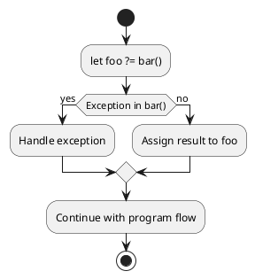

I’ve been following the discussion around the introduction of the `?=` operator and the alternative `try` keyword proposal for error handling in JavaScript. While I still consider it unnecessary (#24) and appreciate the effort to improve error handling, I think both approaches may introduce more complexity than necessary, and I'd like to share my thoughts on why we should reconsider these changes.

The survey #4 results align with what is commonly accepted in the theory and practice of building interpreters and compilers: **error handling is better managed through explicit keywords like `try`, rather than overloading an assignment operator with additional responsibilities**. This approach keeps the language clean, maintainable, and intuitive, ensuring that error handling remains clear and effective.

## Historical Context and Ongoing Debate

The conversation around simplifying error handling with a one-liner like `try-catch` in JavaScript has been ongoing since at least 2019, as seen in this [Discourse thread](https://es.discourse.group/t/try-catch-oneliner/107/62). This history highlights that while there is a desire within the community for more concise error handling, it's also a topic that has generated significant debate.

The fact that similar ideas have been proposed and discussed for several years without being adopted into the language suggests that there are valid concerns and complexities involved. Key issues include:

- **Balance Between Brevity and Clarity**: The desire for a one-liner often conflicts with the need for explicit and clear error handling, which is crucial in JavaScript's dynamic environment.
- **Consistency with Language Philosophy**: JavaScript has traditionally favored explicit and readable code over syntactic shortcuts that could obscure meaning. This is a principle that has kept the language accessible and understandable to a broad range of developers.
- **Community Feedback**: The ongoing discussion also demonstrates that any changes to error handling need to be carefully considered, with input from the community and a thorough evaluation of the potential trade-offs.

Given this context, it's important to approach any new proposals with a full understanding of the history and the reasons why previous attempts at similar changes were not adopted. This should inform whether new syntax or operators are truly necessary or if they simply reintroduce the same unresolved issues.

## Theoretical and Practical Considerations

Firstly, it’s important to consider the principles of compiler and interpreter design. In "Compilers: Principles, Techniques, and Tools" by Aho, Sethi, and Ullman, a clear separation of concerns is emphasized. The idea is that language constructs should be as clear and focused as possible, with specific constructs like operators and keywords serving distinct purposes. Introducing a new operator like `?=` for error handling, or even modifying the use of `try`, blurs the lines between error handling and value assignment, potentially complicating both the language and its interpretation.

## Not All Errors Occur in Value-Returning Operations

One of the critical assumptions in the proposal for the `?=` operator and the `try` keyword modification is that exceptions primarily occur in operations that return values. However, this is not always the case. In many scenarios, exceptions can arise in functions or operations that execute tasks without returning a value, such as:

- **Void Functions**: Functions that perform actions like modifying a global state, writing to a file, or sending a network request may throw exceptions without returning any value. An operator like `?=` or a one-liner `try` would be ill-suited for these cases, as there would be no value to assign or capture.
- **Asynchronous Side Effects**: In asynchronous operations, exceptions can occur at various points that are not directly tied to value-returning expressions. For example, a background task might fail due to network issues or file system errors, and these exceptions need to be handled explicitly, often without a direct return value.
- **Event Handling and Callbacks**: In event-driven programming, exceptions can occur within event handlers or callbacks that are meant to trigger certain actions rather than return values. In these cases, structured error handling via `try-catch` is essential to ensure that exceptions are properly managed without relying on value assignment.

These examples highlight that error handling in JavaScript is a broader and more complex problem than just managing exceptions in value-returning functions. A one-size-fits-all solution like `?=` or a compact `try` expression might overlook these nuances, leading to incomplete or inadequate error management strategies.

While the proposal aims to streamline error handling, it overlooks the diversity of scenarios where exceptions can occur. Error handling needs to be flexible enough to accommodate both value-returning and non-value-returning operations. This reinforces the importance of explicit and comprehensive mechanisms like `try-catch`, which can handle a wide range of error situations in a clear and consistent manner.

## Less Code Doesn’t Always Mean a Better Language

One of the underlying motivations for the `?=` operator and the `try` keyword proposal seems to be the desire to reduce the amount of code required for error handling. While it's true that shorter code can sometimes improve readability, it’s important to remember that brevity should not come at the cost of clarity, maintainability, or correctness.

In language design, the goal is not just to reduce the number of lines of code but to ensure that the code is intuitive, expressive, and easy to reason about. Explicit error handling mechanisms like `try-catch` serve these purposes well because they clearly delineate where and how exceptions are managed. Introducing shortcuts or more compact syntax, such as an assignment operator that also handles errors, could obscure the logic, making it harder for developers to understand and maintain the code.

Moreover, shorter syntax doesn’t necessarily result in better performance or fewer errors. In fact, it can introduce new complexities for the language interpreter and make debugging more challenging. The focus should be on writing clear, explicit code that accurately reflects the developer's intent, rather than simply aiming to reduce the number of characters typed.

So, while the proposal aims to make error handling more concise, it's essential to consider whether this truly leads to better code. Sometimes, more code—if it's clearer and more explicit—can be the better approach.

## Handling Errors with Existing Constructs

JavaScript already provides powerful tools for error handling through the `try-catch` mechanism. While `try-catch` can sometimes lead to nested code or less elegant syntax, the clarity and explicit nature of this approach ensure that developers are fully aware of when and how errors are being handled. This explicitness is crucial, as it reduces the likelihood of accidentally ignoring or mishandling exceptions.

For example, consider the following traditional error handling approach:

```javascript
async function getData() {
    try {
        const response = await fetch("https://api.example.com/data");
        const json = await response.json();
        return validationSchema.parse(json);
    } catch (error) {
        handleError(error);
    }
}
```

This structure is clear in its intent and allows for robust handling of different error types. Introducing `[error, data] = try doSome();` or `[error, data] ?= expression;` might reduce the lines of code, but it could also obscure the error handling logic, making it less obvious to those reading or maintaining the code.

## Runtime vs. Compile-Time Errors

It’s also essential to distinguish between different types of errors. Syntax errors, caught at compile-time by the interpreter, are different from runtime exceptions that occur during the execution of the program. JavaScript’s current error handling mechanisms are well-suited to managing runtime errors explicitly. Delegating this responsibility to an operator or integrating it into a simplified assignment could result in subtle bugs or missed error handling opportunities.

## Insufficient Justification in the Proposal

Upon reviewing the README of the proposal, it becomes clear that while it identifies some real challenges with error handling in JavaScript, it does not sufficiently justify why a new operator like `?=` or even the alternative `try` syntax is necessary or superior to existing methods.

The proposal mentions the potential for simplifying error handling and reducing code nesting, but it doesn't provide concrete evidence that these benefits outweigh the downsides of introducing new language features. For instance:

- **Compatibility and Complexity**: Introducing a new operator or keyword would increase the language's complexity, requiring developers to learn and adapt to new syntax, potentially leading to confusion or misuse.
- **Existing Mechanisms**: JavaScript's current error handling mechanisms, while sometimes verbose, are explicit and clear. They ensure that developers consciously manage errors, which is crucial for maintaining robust code.
- **Ambiguity and Readability**: The proposal risks making error handling less explicit by integrating it into an assignment operator or simplifying it into a one-liner with `try`. This could lead to errors being overlooked or improperly handled, reducing the overall readability and maintainability of the code.

The proposal does not convincingly argue that these changes would result in a net benefit for the language. The introduction of such features should be carefully considered, especially when existing solutions are already well-understood and effective.

## The New Proposal to Use `try` on a Single Line is Also Not Justified

Using `try` as a keyword instead of an operator like `?=` might be a more acceptable alternative, as it would be more consistent with existing practices in JavaScript. However, even this modification raises some questions and challenges:

- **Consistency with `try` Semantics**: Using `try` in this way would be a significant change to current JavaScript semantics. Currently, `try` is used to start a block that may contain exceptions, followed by `catch` to handle them. Introducing `try` as part of an assignment expression like `[error, result] = try doSome();` might confuse developers who are already familiar with traditional `try-catch` usage.
- **Explicit vs. Implicit**: Using `try` in an assignment might make exception handling less explicit. One of the strengths of `try-catch` is that it makes it clear that a potential exception is being handled, whereas introducing `try` in an assignment might make error handling more inconspicuous, potentially leading to errors of omission.
- **Exception Handling and Control Flow**: `try-catch` allows for fine-grained handling of control flow, including the possibility of multiple `catch` and `finally` blocks. Using `try` in an assignment limits these capabilities and might require additional handling if different types of errors need to be caught and handled.
- **Compatibility and Learning Curve**: While it might seem simpler at first glance, this new form of `try` would add a new syntax to the language, requiring developers to learn and understand its nuances. It could also have implications for backward compatibility, and for tools that parse or process JavaScript.

In short, while using `try` instead of an operator might be a less invasive approach, it is still a significant modification that introduces new semantic considerations and potential points of confusion. It is crucial to assess whether the benefits of this new syntax outweigh the potential drawbacks and whether it actually addresses a critical enough problem to warrant the change in the language.

## References and Considerations

Before making such significant changes to the language, it’s worth revisiting foundational texts like "Compilers: Principles, Techniques, and Tools" and "JavaScript: The Definitive Guide" by David Flanagan. These resources underscore the importance of keeping language features both powerful and clear, without overloading them with additional responsibilities that might compromise their original purpose.

## Conclusion

While the intent behind the proposal is commendable, the addition of the `?=` operator or a modified `try` keyword for error handling may not be the best path forward. JavaScript’s existing error handling mechanisms, though sometimes verbose, offer a level of clarity and explicitness that is crucial for maintaining robust and understandable code. I would urge the committee to consider whether these proposed changes truly solve a critical problem or if they risk introducing unnecessary complexity into the language.

Thank you for considering my input.


**Question: Does the proposed operator control flow?  
Answer: Yes!**

Exceptions are meant for handling unexpected situations that a function cannot control, such as missing dependencies, network errors, .... **An assignment operator should not be responsible for controlling the flow of exceptions**—that’s what structures like `try-catch` are designed for. Mixing assignment with flow control can blur the lines between different responsibilities in the code, leading to confusing and error-prone practices.

In the proposal, when you write ...

```js
let foo ?= bar()
```

... and an exception occurs in `bar()`, **the operator is capturing that exception**, acting like a hidden `try-catch`. This means the operator is controlling the flow of the program, which is not the purpose of an assignment operator. This can lead to unclear code and bad practices by making exceptions less explicit and harder to manage.

By embedding exception handling directly into an assignment operator, the proposal risks confusing the role of assignment versus flow control, potentially leading to less readable and maintainable code.




Here's how the steps compare between a traditional `try-catch` block and the proposed `?=` operator:

### Traditional `try-catch` Block

1. **Start capturing exceptions:** The `try` block begins, which prepares the program to catch any exceptions that may be thrown within its scope.
2. **Execute code:** The program executes the code inside the `try` block.
3. **Stop capturing exceptions:** The `try` block ends, and control is handed to the `catch` block if an exception occurs.
4. **Exception handling:**
    - **Yes:** If an exception occurs, it is passed to the `catch` block, where it can be handled explicitly.
    - **No:** If no exception occurs, the program skips the `catch` block and continues with the next line after the `try-catch`.
5. **Continue program flow:** The program continues executing normally after the `try-catch`.

### Proposed `?=` Operator

1. **Prepare memory zone:** Allocate memory to store either the result or an error.
2. **Operator starts capturing exceptions:** The `?=` operator prepares to intercept any exceptions that may occur during the execution of the function.
3. **Execute code:** The function is executed.
4. **Operator stops capturing exceptions:** The operator ends its interception.
5. **Exception handling:**
    - **Yes:** If an exception occurs, the operator stores the exception in the prepared memory zone.
    - **No:** If no exception occurs, the operator stores the function's result in the memory zone.
6. **Continue program flow:** The program continues executing after the operation, with the memory zone now containing either the result or the exception.

### Key Differences

- **Explicit vs. Implicit Control:** In the traditional method, control flow is explicit and visible in the code. The `try-catch` block clearly shows where exceptions are handled. In the proposed method, the control flow is implicit within the operator, which could make it harder to understand at a glance how exceptions are being handled.
- **Flexibility:** The traditional `try-catch` allows for more complex and fine-grained control over how different types of exceptions are handled. The proposed operator simplifies error handling but at the cost of flexibility and clarity.
- **Code Readability:** The traditional method maintains clear separation between normal code execution and error handling. The proposed operator blurs this line, potentially making the code less readable and maintainable.