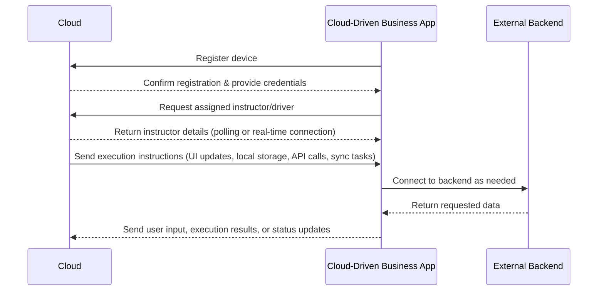
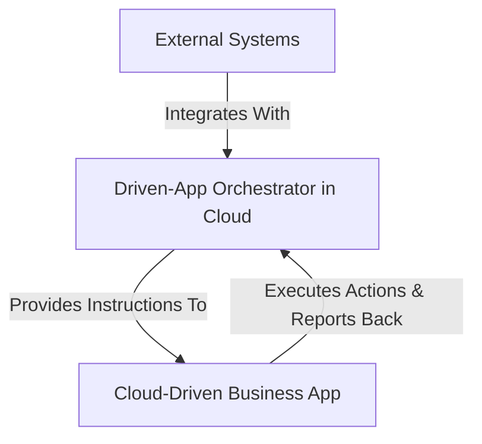

> [!WARNING]
> This document is a work in progress and subject to modifications.

## Introduction

Traditional enterprise applications rely on embedded business logic, limiting flexibility and scalability. Every change requires a new version, increasing costs and slowing down innovation. Cloud-Driven Business App (CDBA) is a new paradigm where the application obtains its logic, UI behavior, and workflows dynamically from the cloud, eliminating the need for constant updates.

Unlike traditional approaches where the backend dictates exact UI elements, a Cloud-Driven Business App operates based on high-level instructions from the cloud. The app utilizes precompiled UI components, ensuring optimal performance while allowing flexibility in data presentation. Instructions from the cloud define what actions to take rather than specifying exact UI layouts. 

By decoupling logic from implementation, Cloud-Driven Business Apps enhance maintainability, enable faster iteration cycles, and reduce dependency on frequent application updates.

## What is a Cloud-Driven Business App?

A Cloud-Driven Business App is an application whose behavior is completely managed from the cloud. Instead of having rigid embedded logic, the app:

- Receives instructions from the cloud on what to do and how to behave, ensuring that only specific and necessary commands or predefined workflows are retrieved.
- Renders dynamic UI based on precompiled components for optimal performance.
- Executes business workflows in real-time, defined externally and stored persistently on the device for offline execution.
- Can connect to different backends as needed for the business flow.
- Supports offline execution and synchronization with the cloud when connected.

### Cloud-Driven App vs. Cloud-Driven Business Apps

Not all cloud-driven applications are the same. Any app could, in theory, be driven from the cloud, but this is only viable for business applications due to their structured and predictable workflows. In contrast, high-performance applications like 3D games generate too many requests and require low-latency state management, making cloud-driven execution impractical. Business applications, on the other hand, operate with predefined flows and modular actions, allowing efficient cloud management without excessive communication overhead.

## Benefits

### **Greater Agility and Flexibility**

Companies can modify their workflows without needing to update the app on users' devices. This allows **rapid response to business changes** without additional development costs.

### **Reduced Maintenance and Development Costs**

- No need to maintain multiple versions of the app for different clients or environments.
- Changes in business logic are applied **centrally in the cloud**, but can be selectively tailored to specific users, groups, or regions as needed.
- Reduced development, maintenance, and support costs.

### **Applicable Across Multiple Industries**

This model applies to **any industry** requiring flexibility and control over business processes:

- **Retail:** Dynamically adapt sales, inventory, and promotions workflows.
- **Logistics and Supply Chain:** Automate routes, delivery assignments, and confirmations.
- **Finance:** Control approvals, audits, and real-time validations.
- **Manufacturing:** Dynamically define production and quality control processes.

### **Global Scalability**

Companies can operate across multiple regions without needing local infrastructure deployment. The cloud allows **automatic load balancing** and effortless horizontal scaling.

## Cloud-Driven Integration and Connectivity

A key aspect of a Cloud-Driven Business App is its ability to integrate with a variety of cloud services and enterprise tools. This is achieved through an intelligent orchestration layer, which we refer to as the Driven-App Orchestrator. This orchestrator acts as the middleware between the app, cloud services, and other enterprise systems.

### 1. The Driven-App Orchestrator

- Acts as the central hub for managing app interactions.
- Connects the app to cloud-based tools, such as AWS Lambda, Step Functions, or Azure Logic Apps.
- Ensures that business workflows are executed in sync with external systems, such as BPM engines, databases, or third-party services.

### 2. Possible Integrations

A Cloud-Driven Business App can leverage various cloud services to optimize performance, workflow execution, and data management. Some key integrations include:
- Business Process Management (BPM) Systems → Apps can interact with BPM engines like jBPM, Camunda, or AWS Step Functions to execute structured business workflows.
- Event-Driven Architectures → The orchestrator can use AWS EventBridge, Kafka, or Azure Event Grid to handle real-time notifications and asynchronous processes.
- Serverless Computing → Business logic can be executed on demand using AWS Lambda, Azure Functions, or Google Cloud Functions, reducing infrastructure dependencies.
- Low-Code Automation → Integrations with Node-RED or Power Automate allow rapid development of automation flows, enabling faster iteration cycles without extensive coding.
- Monolithic and Legacy Systems → The orchestrator can bridge communication between the app and existing ERP, CRM, or other enterprise systems, allowing a smooth digital transition.
- AI and Machine Learning Services → The cloud can process data and provide insights through services like AWS SageMaker, Google AI, or OpenAI APIs, optimizing business decision-making.

### 4. Cloud-Driven Workflow Execution

- Depending on the business needs, workflows can be managed in different ways:
  - Direct Execution → The app receives an instruction and executes it immediately.
  - BPM Integration → The app interacts with a BPM system that dictates step-by-step execution.
  - Event-Triggered Execution → Actions are triggered based on external events, such as IoT device signals or user input.

The Driven-App Orchestrator serves as the control layer, ensuring that business processes are streamlined and efficient while leveraging the full power of cloud-based services.

## Technical Components

A **Cloud-Driven Business App** consists of the following components:

### **The Cloud (Centralized Orchestration)**

- Defines **business flows, UI, and rules** for the app.
- Controls **permissions, authentication, and security.**
- Can use **any backend** as required by the process.

### **The App (Mobile or Desktop Client)**

- **Has no fixed business logic.**
- Renders UI **according to cloud instructions**, utilizing precompiled components for efficiency.
- Supports **offline storage** and background synchronization, ensuring that workflows persist on the device for continuous execution.

### **Communication Protocols**

To ensure robust integration, it is essential to define a structured communication protocol that enables seamless interaction between the cloud and the app. This protocol should specify how commands, workflows, and updates are transmitted, ensuring consistency and efficiency in execution. The choice of format (e.g., JSON, Protobuf) depends on the specific requirements of performance, scalability, and security.

## Security and Authentication

To ensure security, the app and cloud must communicate using:
- **OAuth 2.0 / JWT** for secure authentication.
- **X.509 Certificates** for device validation.
- **Granular permission control** by user/role.
- **Encryption of data in transit and at rest.**
- **Cloud-Specific Onboarding Options** – Depending on the cloud provider, onboarding mechanisms may vary. This can include device provisioning via AWS IoT, Azure Device Provisioning Service, or Google Cloud IoT Core, ensuring secure and scalable deployment of cloud-driven applications.

## Conclusion

**Cloud-Driven Business Apps** leverage the homogeneity of this type of application, making cloud-driven execution feasible and efficient. Unlike applications such as 3D games, which require complex real-time rendering and state management that are difficult to orchestrate from the cloud, business applications follow structured workflows that can be efficiently managed and executed remotely. This approach enables **flexibility, scalability, and cost reduction**, allowing companies to **optimize their processes without modifying app code**, thereby enhancing operational efficiency and digital transformation.

# Creative Commons Attribution 4.0 International (CC BY 4.0)

This document is licensed under the Creative Commons Attribution 4.0 International License.
You are free to:
- Share — copy and redistribute the material in any medium or format.
- Adapt — remix, transform, and build upon the material for any purpose, even commercially.

**You must give appropriate credit**, provide a link to the license, and indicate if changes were made.

🔗 License details: [CC BY 4.0](https://creativecommons.org/licenses/by/4.0/)