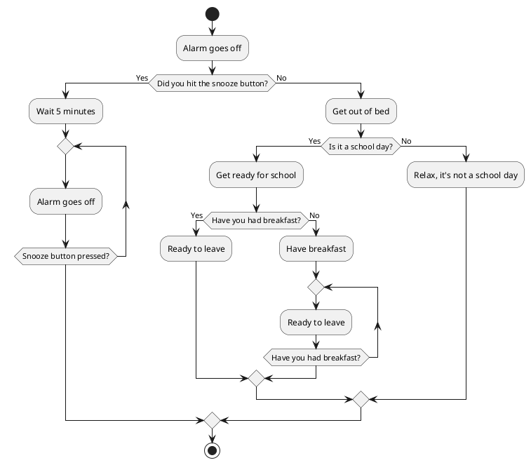

#History

In February 1997, at the age of 11 and while in the 6th grade, I had my first encounter with a computer. This moment marked the beginning of my fascination with technology.

## Learning Program Design with Flowcharts

Before typing a single line of code, I was introduced to the art of planning and designing programs using flowcharts. This foundational step involved mapping out the logical flow of the program's execution, identifying decision points, and specifying the sequence of operations. Understanding the importance of a well-structured plan laid the groundwork for my programming endeavors on the [Amstrad PCW](https://en.wikipedia.org/wiki/Amstrad_PCW). Armed with flowcharts, I translated these visual representations into Mallard BASIC code, fostering a holistic approach to problem-solving in the world of computing.


## Amstrad PCW

![[Amstrad PCW.png|300]]

The first computer I started working with was an Amstrad PCW. This device operated on the [CP/M](https://en.wikipedia.org/wiki/CP/M) operating system, and it was here that I initiated my programming journey using the [Mallard BASIC language](https://en.wikipedia.org/wiki/Mallard_BASIC). (Resource: [[Mallard Basic]])

My first program, written in Mallard BASIC, was a simple yet meaningful one. It prompted the user to input a list of integers, calculated their average, and displayed the result. 
# Navigating the Complexities of Basic Programming

![[CPM-Disketes.png]]
The initiation into the world of programming in 1997, with the Amstrad PCW and Mallard BASIC, was a journey through a tapestry of complexities. 

Picture this: powering up the Amstrad PCW and inserting the CP/M operating system floppy disk was just the initial step. Once the system sprang to life, the intricate ballet of floppy disks continued. The transition from the CP/M disk to the BASIC disk marked the next phase, laying the groundwork for programming. However, the process didn't conclude there. The final layer of complexity unfolded as the BASIC disk made way for the dedicated program disk—a repository for both loading and saving code. 

This orchestrated sequence of floppy disks, each with its specific role, added an extra layer of intricacy to the act of programming, turning it into a thoughtful and deliberate endeavor.
### My First Program in Mallard BASIC

```basic 
10 INPUT "Enter the number of integers: ", N 
20 TOTAL = 0 
30 FOR I = 1 TO N 
40 INPUT "Enter an integer: ", A 
50 TOTAL = TOTAL + A 
60 NEXT I 
70 AVERAGE = TOTAL / N 
80 PRINT "The average is "; AVERAGE
```

This straightforward program not only introduced me to the fundamentals of programming but also ignited my passion for exploring the possibilities within the world of coding.

## Challenges of Coding in Mallard BASIC

Writing programs during those times presented unique challenges. Unlike modern graphical text editors, I didn't have the luxury of a user-friendly interface. Instead, I interacted with the code using command-line instructions. Listing and editing lines of code required a series of commands, making the coding process a meticulous and sometimes arduous task. Despite the challenges, it laid the foundation for my coding skills and instilled a sense of perseverance in the face of technological constraints.

## Editing Mallard BASIC Code 
### Listing Code Lines: 

To list all lines of code in your Mallard BASIC program, you would use the `LIST` command: 

```basic 
LIST
```

This command displays the entire program on the screen, providing a comprehensive view of your written code.

### Editing Code Lines:

To edit a specific line of code, you can use the `EDIT` command followed by the line number. In the context of Mallard BASIC, this would open a text-based interface, showing the line you're editing. After making modifications, pressing Enter would save your changes:

```basic
EDIT 10
```

This example opens a text-based interface for editing line 10, allowing you to make modifications. After editing, pressing Enter would save your changes.

### Adding New Code Lines:

To add new lines of code, you can specify the line number followed by a space and then the code you wish to add. If the line already exists, it will open in the text-based editor; otherwise, a new line will be created directly.

```basic
50 PRINT "This is a new line"`
```

This example adds a new line at line number 50 with the specified code.
### Deleting Code Lines:

To delete lines of code, utilize the `DELETE` command followed by the range of lines you want to remove.

```basic
DELETE 30-40
```

This example deletes lines 30 to 40 from the program.

Editing Mallard BASIC code in this manner was a unique experience, providing a text-based interface where you could directly interact with and modify each line of code.

## Running and Managing Programs on Amstrad PCW with Mallard BASIC  
### Running Programs:  
To execute a Mallard BASIC program, you would use the `RUN` command:

```basic 
RUN
```

This command initiates the execution of the loaded program in RAM.
### Stopping Programs:

To interrupt or stop a running program, you could use the key combination `CTRL + C`. This keyboard shortcut would halt the execution of the program.

### Loading and Saving Programs:

Due to the absence of a hard disk on the Amstrad PCW, program storage was facilitated through the use of 3-inch floppy disks. You could load a program into memory using the `LOAD` command:

```basic
LOAD "PROGRAM.BAS"
```

Conversely, to save a program to a floppy disk, you would use the `SAVE` command:

```basic
SAVE "PROGRAM.BAS"
```

These commands allowed you to transfer programs between the Amstrad PCW and external storage.

The Amstrad PCW, lacking a hard drive, relied on the limited but versatile 3-inch floppy disks for program storage and transfer.

## The Importance of a Distraction-Free Environment

Looking back, one of the remarkable aspects of programming on the Amstrad PCW was the minimalistic and distraction-free environment it provided. In contrast to the multitasking-rich environments of today's technologies, the simplicity of the Amstrad PCW encouraged focused learning and programming.

With few distractions, I could immerse myself in the world of coding without the constant interruptions and temptations present in modern computing environments. This uncluttered space allowed for a deeper understanding of programming concepts, fostering a strong foundation for my journey as a programmer.

### The Challenge of Multitasking for Beginners

In today's fast-paced digital landscape, the ability to multitask is often considered a valuable skill. However, for beginners diving into the world of programming, multitasking can be a significant obstacle. The Amstrad PCW's limited distractions inadvertently created an optimal learning space, enabling me to concentrate on the essential aspects of coding without the complexities of managing multiple applications simultaneously.

This intentional focus on a single task at a time facilitated a more profound comprehension of programming principles and laid the groundwork for a successful programming career.

## Starting Early: The Significance of Early Programming Education

### Building a Foundation for the Future

One of the most remarkable aspects of my early programming journey was the opportunity to start learning at a young age. The formative years offer an invaluable window of opportunity to absorb new concepts and skills rapidly. As I navigated the world of programming on the Amstrad PCW, I realized that laying the groundwork for a programming mindset early on was akin to constructing a solid foundation for a building.

### Enhanced Cognitive Development

Numerous studies suggest that early exposure to programming and computational thinking enhances cognitive development in children. Learning to code involves problem-solving, logical reasoning, and creativity—skills that are not only fundamental to programming but also contribute to overall cognitive growth.

The Amstrad PCW, despite its vintage charm, served as a time machine for me, transporting me to an era where the seeds of programming curiosity were planted early. The structured and logical nature of coding provided a mental workout that undoubtedly contributed to my cognitive development.

### Cultivating a Lifelong Skill

Learning to program at a young age instills a sense of familiarity and comfort with technology. In an era where digital literacy is increasingly vital, early exposure to programming equips individuals with a skill that transcends age and continues to be relevant throughout life.

The Amstrad PCW, as my first programming playground, played a crucial role in fostering this early connection with technology. The lessons learned during those early coding endeavors set the stage for a lifelong affinity with programming and technology in general.
### Encouraging Curiosity and Exploration

The simplicity of the Amstrad PCW environment encouraged a sense of curiosity and exploration. The absence of overwhelming complexities allowed me to experiment, make mistakes, and learn from them. This spirit of discovery, nurtured from a young age, remains a driving force behind my passion for problem-solving and creative expression through programming.

### Nurturing the Seeds of Innovation

While the technology landscape has evolved significantly since the Amstrad PCW era, the timeless importance of introducing programming at a young age remains steadfast. Early exposure to coding not only builds practical skills but also instills a mindset of curiosity, resilience, and innovation.

As we reflect on the intersection of technology and education, fostering an environment that encourages children to explore the world of programming becomes a key investment in shaping the innovators of tomorrow. The Amstrad PCW, with its simplicity and early introduction to programming, served as a catalyst in nurturing the seeds of innovation that continue to grow to this day.

# Shaping the Programmer: Early Enthusiasm

![[Carmen San Diego Game.png]]
The seeds of my journey into the realm of programming were planted in 1997 when, as a young enthusiast, I crafted a game replica of the iconic [Carmen Sandiego](https://en.wikipedia.org/wiki/Carmen_Sandiego) using Mallard BASIC on the Amstrad PCW. This venture, sparked by a day of gaming inspiration, led to the creation of intricate flowcharts and over 500 lines of code. It was this commitment and earnest effort that caught the attention of my professor, igniting a mentorship that went beyond the ordinary classroom interactions. This pivotal moment marked the beginning of a more dedicated exploration of software development, where my passion for programming began to transcend the realm of hobbyist curiosity.
# Conclusions

My journey with the Amstrad PCW has been a revealing exploration that has left a lasting imprint on my path as a programmer. From learning the basics of program design through flowcharts to experimenting with Mallard BASIC in a minimalist environment, each phase has contributed to my unique understanding of programming.

The execution and management of programs on the Amstrad PCW, with its focus on efficiency and simplicity, highlights the significance of a distraction-free environment. In contrast to today's complexities, this environment provided the necessary space for deep immersion in programming and learning without constant interruptions.

Exploring the importance of learning to program from an early age underscores the enduring relevance of cultivating programming skills and mindsets from childhood. The cognitive and practical benefits of this early exposure persist throughout life, contributing to a strong connection with technology.

In summary, the Amstrad PCW, though a relic of the past, has proven to be an invaluable mentor in my journey as a programmer. Its simplicity, emphasis on careful design and efficient execution, and the importance of starting early in programming learning have formed the pillars of my approach to computer science. As we navigate a constantly evolving technological world, these timeless lessons serve as fundamental guides in the practice and education of programming.
